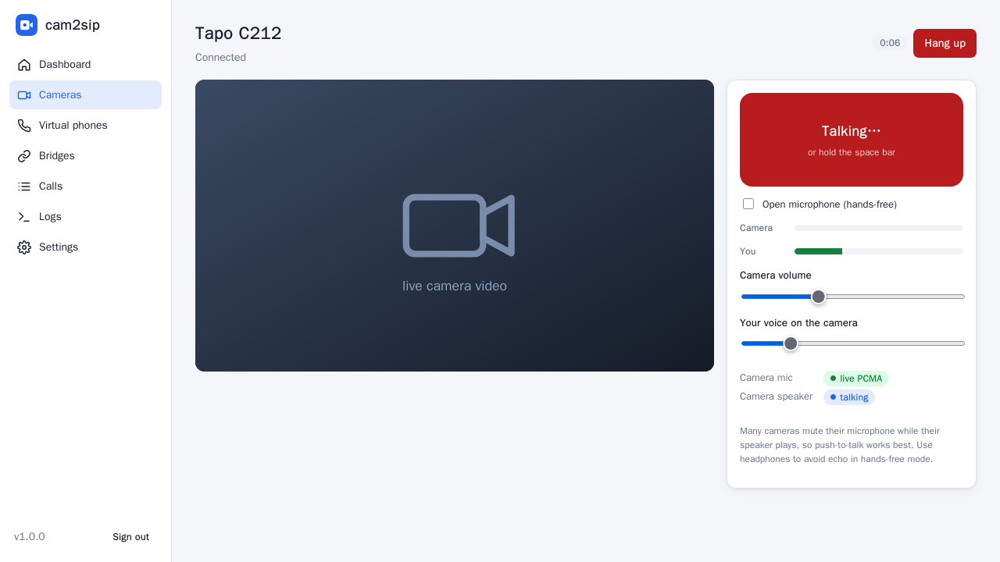
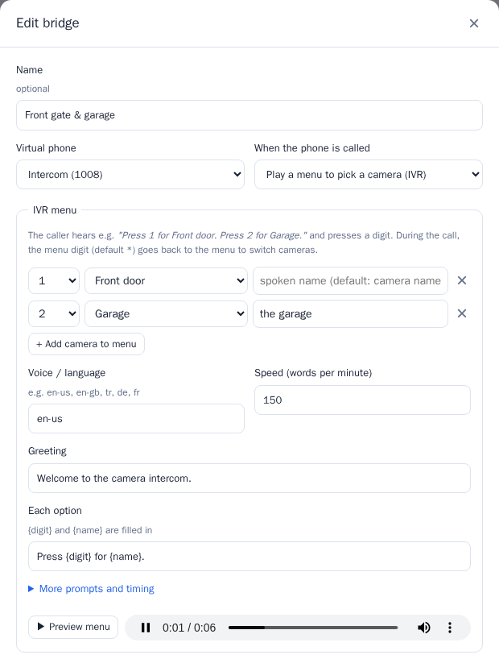
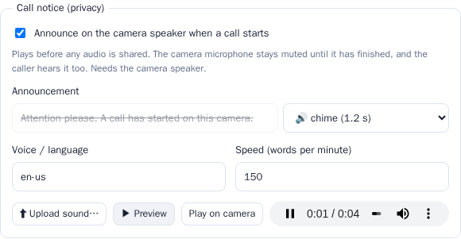
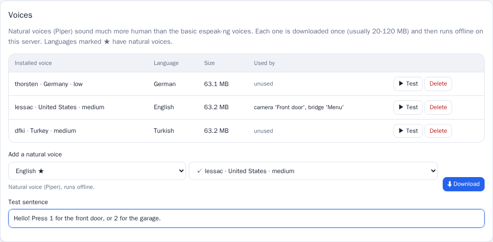
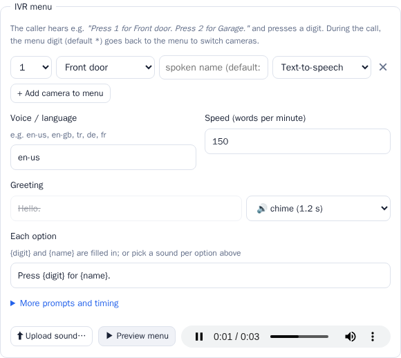

# cam2sip

[](https://github.com/revocx35/cam-to-sip/actions/workflows/ci.yml)
[](https://github.com/revocx35/cam-to-sip/pkgs/container/cam-to-sip)
[](LICENSE)

**Turn IP cameras into SIP intercoms.** cam2sip registers virtual SIP phones on your PBX and bridges each one to a camera. Call the extension from any desk phone or softphone: **you hear the camera's microphone and your voice comes out of the camera's speaker**. It works the other way too, with the camera calling a phone like a doorbell. You can also **call a camera straight from the web UI**, with live video and push-to-talk in the browser.

Runs as a small Docker Compose stack with a web UI for configuration.

```
 IP phone ──SIP/RTP──► PBX (FreePBX/Asterisk) ──SIP/RTP──► cam2sip ──RTSP / Tapo / ONVIF (via go2rtc)──► camera
   you talk  ─────────────────────────────────────────────────────────────────────────────────────►  camera speaker
   you hear  ◄─────────────────────────────────────────────────────────────────────────────────────  camera microphone
```


<table>
<tr>
<td></td>
<td></td>
</tr>
<tr>
<td></td>
<td></td>
</tr>
</table>

## Features

- **Virtual SIP phones**: any number of SIP accounts registered to one or more PBXs (UDP, digest auth, auto re-register).
- **Two-way camera audio**: camera mic → caller, caller → camera speaker, through [go2rtc](https://github.com/AlexxIT/go2rtc):
  - **TP-Link Tapo** (C2xx and others) using Tapo's own talk-back protocol,
  - **ONVIF Profile T** cameras with an RTSP audio backchannel (Hikvision, Dahua, Reolink, Amcrest…),
  - **any go2rtc source** (`rtsp://`, `tapo://`, `dvrip://`, `exec:` backchannels, …).
- **Bridges** link a phone to a camera (or to an IVR menu of cameras), with auto-answer after N rings, mic/speaker gain, a noise gate, a caller list and a max call duration. **One phone can have several bridges**, chosen by caller ID (e.g. 1005 gets the IVR menu, 1006 goes straight to a camera).
- **Outbound "doorbell" calls**: the camera calls an extension or ring group, from the UI or the REST API (Home Assistant, Frigate, Node-RED…).
- **IVR camera menu**: one virtual phone can serve several cameras. Callers hear a spoken menu (*"Press 1 for Front door. Press 2 for Garage."*), press a digit, and can press `*` during the call to switch.
- **Natural voices**: offline neural text-to-speech (Piper) in about 40 languages, downloaded on demand, with espeak-ng (100+ languages) as fallback.
- **Call notice (privacy)**: per camera, announce *"A call has started on this camera"* (your own text, or an uploaded recording) on the camera speaker when any call connects. The camera mic stays muted until it has played.
- **Uploaded sounds**: use your own recordings (MP3, WAV, OGG, M4A…) for IVR prompts and call notices instead of text-to-speech.
- **Browser calls**: click *Call* on a camera to get live video plus two-way audio in the browser, with push-to-talk (button or space bar) or hands-free open mic. No SIP phone needed.
- **DTMF actions**: a keypad digit fires an HTTP webhook (e.g. *press 1 to open the gate*) and can hang up.
- **Web UI**: dashboard with live call and media stats, camera snapshots, a *Listen* (mic) test, a *Test speaker* chime, ONVIF stream discovery, call history and live logs.
- **Lightweight**: pure-Python asyncio SIP/RTP stack (G.711 A-law/μ-law), no Asterisk or PJSIP inside. Transcoding and gain cost one table lookup per byte.

## Tested with

| Component | Version |
|---|---|
| PBX | FreePBX 17 (Asterisk 22.10, chan_pjsip, UDP) |
| Camera | TP-Link **Tapo C212**, firmware 1.5.1: mic via RTSP, speaker via `tapo://` |
| IVR | English and Turkish prompts (espeak-ng 1.52), RFC 4733 DTMF, menu → camera → `*` → other camera |
| Sounds / notice | MP3 upload decoded in Chromium, call notice played on the C212 before the mic opened |
| Browsers | Firefox (full browser call, headless test), Chromium (audio path, headless). Uses standard AudioWorklet + MSE, as in Chrome, Edge and Safari |
| go2rtc | 1.9.14 |
| Host | Docker 29 / Compose v5 on Ubuntu (x86-64) |

## Quick start

Requirements: a Linux host with Docker and Compose, on a network that can reach both the PBX and the cameras.

```bash
git clone https://github.com/revocx35/cam-to-sip.git
cd cam-to-sip
cp .env.example .env          # optional: ports, admin password, advertised IP
docker compose up -d --build  # or: docker compose pull && docker compose up -d  (prebuilt amd64/arm64 image)
```

Open **http://&lt;server-ip&gt;:8090**, choose an admin password, then follow the steps below. For browser calls with your microphone, use **https://&lt;server-ip&gt;:8443** (see [Browser calls](#browser-calls)).

1. **PBX**: create a SIP extension for the camera (FreePBX: *Applications → Extensions → Add Extension → SIP [chan_pjsip]*). See [docs/freepbx.md](docs/freepbx.md).
2. **Cameras → Add camera**: for a Tapo, enter the camera IP, the *camera account* (Tapo app → camera → Advanced settings → Camera account) and your **TP-Link cloud password** (needed for the speaker). Click **Test connection**; you should see `Microphone: PCMA/8000` and `Speaker: PCMA/8000`. See [docs/cameras.md](docs/cameras.md).
3. **Virtual phones → Add phone**: enter the PBX IP, the extension number and its secret. The badge turns green (**registered**).
4. **Bridges → New bridge**: pick the camera and the phone.
5. **Call the extension.** You'll hear the camera and can talk through it. Or click **Call** on the camera to talk from your browser.

### Deploy without the source (prebuilt image)

[`deploy/docker-compose.yml`](deploy/docker-compose.yml) is a standalone file using `ghcr.io/revocx35/cam-to-sip` (amd64/arm64), with every setting inline:

```bash
mkdir -p ~/cam2sip && cd ~/cam2sip
curl -fsSLO https://raw.githubusercontent.com/revocx35/cam-to-sip/main/deploy/docker-compose.yml
docker compose up -d
```

Docker inside a Proxmox LXC needs the container options `nesting=1` (plus `keyctl=1` if unprivileged).

### Moving to another host

Your configuration lives in the `cam2sip_cam2sip-data` volume. Leave out `tls/` so the new host gets a certificate for its own IP.

```bash
# old host
docker run --rm -v cam2sip_cam2sip-data:/data:ro -v "$PWD":/backup alpine \
  tar czf /backup/cam2sip-data.tgz --exclude=./tls -C /data .
docker compose down -v

# new host (in the folder with docker-compose.yml and cam2sip-data.tgz)
docker compose create
docker run --rm -v cam2sip_cam2sip-data:/data -v "$PWD":/backup alpine \
  sh -c "tar xzf /backup/cam2sip-data.tgz -C /data && chown -R 1000:1000 /data"
docker compose up -d
```

## Configuration

All settings are optional environment variables, set in `.env` (see [.env.example](.env.example)):

| Variable | Default | Purpose |
|---|---|---|
| `WEB_PORT` | `8090` | Web UI / REST API port (HTTP) |
| `HTTPS_PORT` | `8443` | Same UI over HTTPS, needed for the microphone in browser calls. `0` turns it off |
| `TLS_CERT` / `TLS_KEY` | *(self-signed)* | Your own certificate/key paths inside the container. Otherwise a self-signed pair is created in `/data/tls` |
| `ADMIN_PASSWORD` | *(empty)* | Initial admin password (otherwise chosen in the UI on first visit). At least 10 characters |
| `SIP_PORT` | `5062` | Local UDP port shared by all virtual phones |
| `RTP_PORT_MIN` / `RTP_PORT_MAX` | `16000` / `16199` | UDP range for call audio (one port per call) |
| `ADVERTISE_IP` | auto | IP address put in SIP Contact/SDP. Auto = the interface that routes to the PBX |
| `GO2RTC_API_PORT` / `GO2RTC_RTSP_PORT` | `11984` / `18554` | go2rtc, bound to 127.0.0.1 only |
| `TALK_PORT` | `18555` | Internal RTSP server that go2rtc pulls speaker audio from (127.0.0.1) |
| `PIPER_PORT` | `18556` | Internal natural-voice TTS process (127.0.0.1) |
| `LOG_LEVEL` | `INFO` | `DEBUG`, `INFO`, `WARNING` |
| `SIP_TRACE` | `false` | Log every SIP message (debugging registration/calls) |
| `SECURE_COOKIES` | `auto` | `Secure` session cookie: `auto` = when a trusted reverse proxy reports HTTPS, `true` = always, `false` = never |
| `TRUSTED_PROXIES` | `private` | Reverse proxies allowed to set `X-Forwarded-For`/`-Proto`: comma-separated IPs/networks, `private` (loopback + private networks) or `none`. Login throttling uses the client IP they report |

Cameras, phones and bridges are stored in the `cam2sip-data` Docker volume (`/data/config.json`, mode 0600). Back up that volume to keep your configuration.

### Network & firewall

Both containers use **host networking**. SIP and RTP need real, reachable addresses, and Docker NAT breaks them. If the host has a firewall, allow:

| Port | Protocol | From | Purpose |
|---|---|---|---|
| 8090 | TCP | admins | Web UI |
| 8443 | TCP | admins | Web UI over HTTPS (browser calls with microphone) |
| 5062 | UDP | PBX | SIP signalling |
| 16000–16199 | UDP | PBX (or phones with direct media) | RTP audio |

```bash
sudo ufw allow 8090/tcp && sudo ufw allow 8443/tcp && sudo ufw allow 5062/udp && sudo ufw allow 16000:16199/udp
```

go2rtc and the talk server listen on `127.0.0.1` only, so the stack can run next to Frigate, whose own go2rtc uses 1984/8554.

## Using it

### Answering behaviour (bridge settings)

| Setting | Meaning |
|---|---|
| Ring before answering | Seconds of ringing before auto-answer (0 = immediately). The camera audio connects while it rings, so audio starts instantly. |
| Max call duration | Hard limit, then cam2sip hangs up. |
| Allowed callers | Caller IDs allowed to call in; others get `403`. Empty = anyone. |
| Mic / speaker gain | dB gain for each direction. |
| Noise gate | Phone audio below the threshold (dBFS) isn't sent to the camera. Many cameras (Tapo included) **mute their microphone while the speaker plays** (echo cancellation), so gating the line's background noise keeps you able to hear the camera between sentences. |
| Hang-up digit / DTMF actions | A digit ends the call and/or fires an HTTP request. |

A camera can only be in one call at a time; a second caller gets `486 Busy Here`.

### Several bridges on one phone (routing by caller)

A virtual phone can have **several bridges**. Each incoming call goes to:

1. the bridge whose **Allowed callers** list contains the caller's number, otherwise
2. the phone's **default bridge**, the one with an empty *Allowed callers* list, otherwise
3. nowhere: the call is rejected (`403`).

Example on extension 1008:

| Bridge | Allowed callers | Result |
|---|---|---|
| "Menu" (IVR: 1 Front door, 2 Garage) | `1005` | 1005 hears the camera menu |
| "Garage" (direct) | `1006` | 1006 is connected straight to the garage camera |
| "Front door" (direct) | *(empty)* | everyone else goes to the front door (optional; without it others are rejected) |

The same caller can't be listed on two enabled bridges of one phone, and a phone can have only one default bridge. The bridge form and the *Virtual phones* page show each phone's routing. Calls through different bridges can run at the same time, as long as they use different cameras.

### IVR: one phone, several cameras

In **Bridges → New bridge**, set *When the phone is called* to **Play a menu to pick a camera (IVR)** and add the cameras with their digits:



- The caller hears the greeting plus one line per camera: *"Press {digit} for {name}."* The spoken name defaults to the camera name; you can set a friendlier one, e.g. "the garage".
- Pressing a digit connects that camera and plays *"Connecting to {name}."* A key press also cuts any prompt short, so regular callers don't have to wait.
- **During the call**, press `*` (the *back-to-menu digit*) to return to the menu and pick another camera.
- Invalid choices and busy cameras are announced, then the menu repeats (3 times by default) before hanging up.
- **Voice / language**: any espeak-ng voice, e.g. `en-us`, `en-gb`, `de`, `fr`, `tr`. Write the prompt texts in the same language, and use **Preview menu** to hear it in the browser.
- DTMF works with RFC 4733 telephone-events (the FreePBX default), SIP INFO, and in-band tones as a fallback.
- Doorbell calls from an IVR bridge (**Call…**/API) connect straight to one of its cameras (`camera_id` in the API).

### Call notice (privacy)

In a camera's settings, enable **Call notice**:



- When **any** call connects to that camera (SIP direct or IVR, doorbell, browser call), the announcement plays on the **camera speaker** first.
- The **camera microphone stays muted** until the notice has finished, and the caller's voice is held back while it plays. The caller hears the notice too, so they know why there is a short pause.
- The announcement is typed text (spoken by text-to-speech in the chosen voice/language) or an uploaded sound. **Preview** plays it in your browser; **Play on camera** plays it on the camera speaker.
- It needs the camera's speaker (for a Tapo, the TP-Link cloud password). Without a working speaker the notice is skipped after 10 s and a warning is logged.

### Natural voices (text-to-speech)

Prompts and call notices can use **natural neural voices** ([Piper](https://github.com/OHF-Voice/piper1-gpl), offline, CPU) instead of the robotic espeak-ng voices.



- Pick a language (★ = natural voices available, about 40 languages including Turkish) and then a voice, in the IVR and call notice settings.
- A voice downloads automatically (about 20–120 MB, from Hugging Face) the first time it's used, saved or previewed. After that it runs offline. Manage voices in **Settings → Voices** (download with progress, test, delete; voices in use are protected).
- New bridges and cameras default to `en_US-lessac-medium`. Existing ones keep their espeak voice until you pick a natural one.
- Piper (GPL-3.0) runs as a separate local process on `127.0.0.1:18556` (`PIPER_PORT`). Expect about 150–200 MB of RAM per loaded voice and about 0.2 s per prompt. If a natural voice is unavailable (e.g. offline), prompts fall back to the matching espeak-ng voice.

### Uploaded sounds

Use your own recordings instead of text-to-speech. Upload them from **Settings → Sounds**, from the IVR section of a bridge, or from a camera's call notice section.

- Any format your browser can play works (MP3, WAV, OGG, M4A/AAC, FLAC, Opus). The browser converts it to 8 kHz telephone audio before uploading; max 120 s.
- Every IVR prompt (greeting, each menu option, invalid, busy, connecting, goodbye) has a *Text-to-speech / sound* selector. A sound replaces that prompt's text.
- **Settings → Sounds** lists all sounds with a player, where they're used, rename and delete. Sounds that are still in use can't be deleted.



### Browser calls

Click **Call** on a camera card, or **Call from browser** on the dashboard. The call page shows the camera's live video and plays its microphone.

- **Hold to talk**: press and hold the big button, or the **space bar**, to speak through the camera speaker. This works best, because many cameras (Tapo included) mute their microphone while their speaker plays.
- **Open microphone**: hands-free, noise-gated. Use headphones to avoid echo.
- Sliders set the camera volume and how loud you are on the camera. **Hang up** (or leaving the page) ends the call.

Browsers only allow the microphone on **secure pages**. Open the UI at **`https://<server-ip>:8443`** and accept the self-signed certificate once. On plain `http://` you can still listen, and the call page links to the secure version. Behind your own HTTPS reverse proxy that's already covered: enable WebSocket support on the proxy (Nginx Proxy Manager: *Websockets Support*).

Browser calls take the camera like a phone call: while one is running, SIP callers get busy, and vice versa. They appear on the dashboard and in the call history.

### Doorbell: let the camera call you

From the UI (**Bridges → Call…**) or from any automation with the API token from **Settings**:

```bash
curl -X POST http://<server>:8090/api/bridges/<bridge-id>/call \
  -H "Authorization: Bearer <api-token>" \
  -H "Content-Type: application/json" -d '{"target": "600"}'    # extension or ring group
# IVR bridges: add "camera_id": "<id>" to choose which of its cameras calls
```

Home Assistant example (`configuration.yaml`):

```yaml
rest_command:
  front_door_intercom:
    url: http://cam2sip-host:8090/api/bridges/<bridge-id>/call
    method: POST
    headers:
      Authorization: !secret cam2sip_token
    content_type: application/json
    payload: '{"target": "600"}'
```

Trigger it from a doorbell button, a Frigate `person` event, and so on. The full API is described in [docs/api.md](docs/api.md) and served live at `http://<server>:8090/api/docs`.

## Documentation

| Document | Contents |
|---|---|
| [docs/freepbx.md](docs/freepbx.md) | Creating the extension on FreePBX / Asterisk, recommended settings |
| [docs/cameras.md](docs/cameras.md) | Tapo, ONVIF and custom cameras; how to check two-way audio |
| [docs/api.md](docs/api.md) | REST API reference and automation examples |
| [docs/troubleshooting.md](docs/troubleshooting.md) | Registration, one-way audio, Tapo issues, logs |
| [ARCHITECTURE.md](ARCHITECTURE.md) | How it works inside: components, call and media flows, design decisions |

## Security

- The web UI needs the admin password (at least 10 characters). The API accepts the session cookie or `Authorization: Bearer <token>`.
- Wrong passwords are throttled: after 5 failures a client IP is locked out for 30 s, doubling up to 1 h, and after 50 failures in a row from anywhere, only one try per 15 min is allowed. The API answers `429` with `Retry-After`. The lockout lives in memory: restart the container to clear it.
- Requests that another site starts in the browser (including sibling subdomains of the same domain) are refused with `403`. Browser-call WebSockets are only accepted from the cam2sip page itself (checked with `Sec-Fetch-Site`, or `Origin` in browsers that don't send it). Your reverse proxy must pass the original `Host` header (Nginx Proxy Manager does).
- Camera, cloud and SIP passwords are stored in plain text in `/data/config.json` (file mode 0600), because they're needed to authenticate. Protect the host and the volume.
- The UI is served over HTTP (:8090) and HTTPS (:8443) with a self-signed certificate. For access beyond your LAN, put it behind a TLS reverse proxy (nginx, Caddy, Nginx Proxy Manager) with WebSockets enabled:
  - **Set the admin password before you publish the proxy host** (or set `ADMIN_PASSWORD`). Until a password exists, whoever opens the UI first chooses it.
  - The session cookie becomes `Secure` automatically (`SECURE_COOKIES=auto`) when the proxy connects from a private address, which covers a proxy on the same host or LAN. If your proxy connects from a public address, add it to `TRUSTED_PROXIES`. Only list real proxies: whoever connects from a trusted address can claim any client IP.
  - Behind a second proxy (e.g. Cloudflare in front of Nginx Proxy Manager), add that proxy's ranges to `TRUSTED_PROXIES` too, otherwise throttling sees its address instead of the client's.
  - A logged-in admin can point a *custom* camera at any go2rtc source, including ones that run programs (`exec:`). Treat the admin password like a password for the host.
- Inbound SIP is not authenticated (like a desk phone). Keep UDP 5062 reachable from your PBX only, and use *Allowed callers* where it matters.

## Development

```bash
docker build -t cam2sip-dev -f Dockerfile.dev .            # python + test deps
docker run --rm -v $PWD:/app -w /app cam2sip-dev python -m pytest -q
docker run --rm --network host -v $PWD:/app -w /app cam2sip-dev \
  python tools/sip_test_call.py --server <pbx> --user <ext> --password <secret> --target <bridged-ext>
# IVR: press keys during the call, e.g. choose 2, back to the menu, choose 1
  python tools/sip_test_call.py ... --dtmf 2,*,1 --dtmf-interval 5
# browser call smoke test (Firefox + fake mic), see the script's docstring for the docker command
python tools/browser_call_test.py --password <admin> --camera <camera-id>
```

See [ARCHITECTURE.md](ARCHITECTURE.md) for the code layout and [CLAUDE.md](CLAUDE.md) for contributor notes.

## License

[MIT](LICENSE). cam2sip uses [go2rtc](https://github.com/AlexxIT/go2rtc) (MIT) as a separate container.
