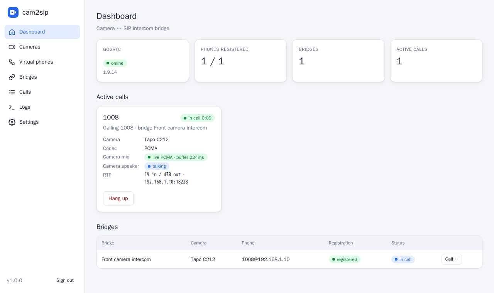
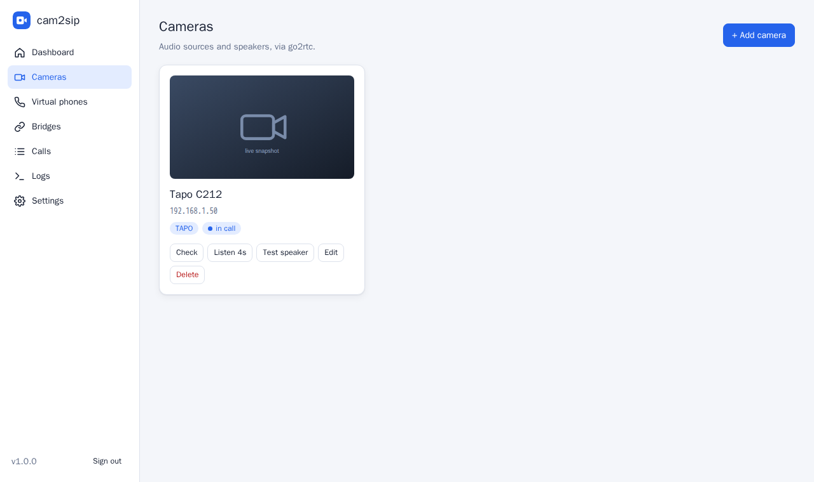
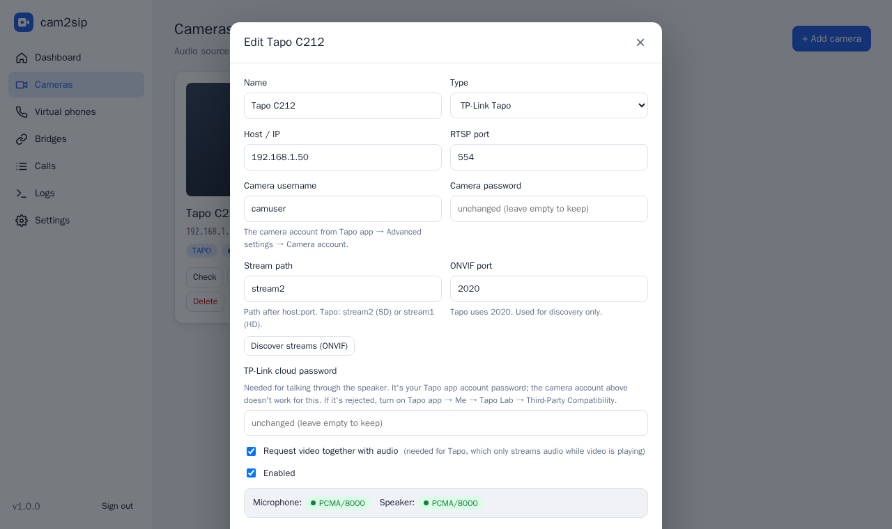
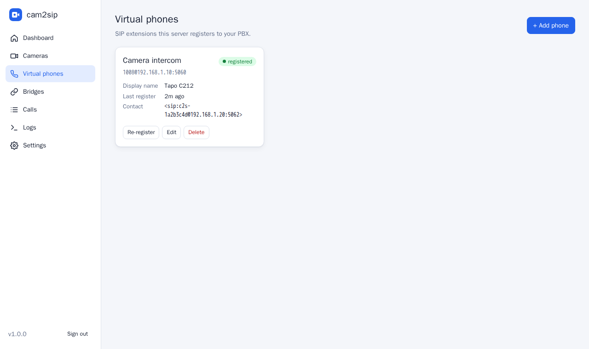
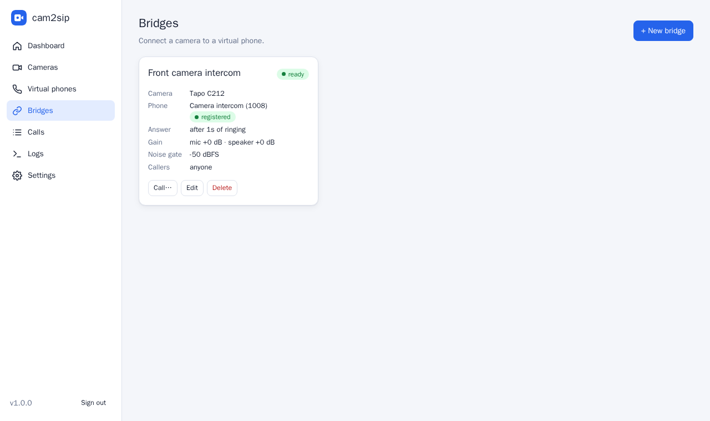

# cam2sip

[](https://github.com/revocx35/cam-to-sip/actions/workflows/ci.yml)
[](https://github.com/revocx35/cam-to-sip/pkgs/container/cam-to-sip)
[](LICENSE)

**Turn IP cameras into SIP intercoms.** cam2sip registers virtual SIP phones on your PBX and bridges each one to a camera. Call the extension from any desk phone or softphone: **you hear the camera's microphone and your voice comes out of the camera's speaker**. It works the other way too, with the camera calling a phone like a doorbell.

Runs as a small Docker Compose stack with a web UI for configuration.

```
 IP phone ──SIP/RTP──► PBX (FreePBX/Asterisk) ──SIP/RTP──► cam2sip ──RTSP / Tapo / ONVIF (via go2rtc)──► camera
   you talk  ─────────────────────────────────────────────────────────────────────────────────────►  camera speaker
   you hear  ◄─────────────────────────────────────────────────────────────────────────────────────  camera microphone
```



<table>
<tr>
<td></td>
<td></td>
</tr>
<tr>
<td></td>
<td></td>
</tr>
</table>

## Features

- **Virtual SIP phones**: any number of SIP accounts registered to one or more PBXs (UDP, digest auth, auto re-register).
- **Two-way camera audio**: camera mic → caller, caller → camera speaker, through [go2rtc](https://github.com/AlexxIT/go2rtc):
  - **TP-Link Tapo** (C2xx and others) using Tapo's own talk-back protocol,
  - **ONVIF Profile T** cameras with an RTSP audio backchannel (Hikvision, Dahua, Reolink, Amcrest…),
  - **any go2rtc source** (`rtsp://`, `tapo://`, `dvrip://`, `exec:` backchannels, …).
- **Bridges** link one camera to one phone, with auto-answer after N rings, mic/speaker gain, a noise gate, a caller whitelist and a max call duration.
- **Outbound "doorbell" calls**: the camera calls an extension or ring group, from the UI or the REST API (Home Assistant, Frigate, Node-RED…).
- **DTMF actions**: a keypad digit fires an HTTP webhook (e.g. *press 1 to open the gate*) and can hang up.
- **Web UI**: dashboard with live call and media stats, camera snapshots, a *Listen* (mic) test, a *Test speaker* chime, ONVIF stream discovery, call history and live logs.
- **Lightweight**: pure-Python asyncio SIP/RTP stack (G.711 A-law/μ-law), no Asterisk or PJSIP inside. Transcoding and gain cost one table lookup per byte.

## Tested with

| Component | Version |
|---|---|
| PBX | FreePBX 17 (Asterisk 22.10, chan_pjsip, UDP) |
| Camera | TP-Link **Tapo C212**, firmware 1.5.1: mic via RTSP, speaker via `tapo://` |
| go2rtc | 1.9.14 |
| Host | Docker 29 / Compose v5 on Ubuntu (x86-64) |

## Quick start

Requirements: a Linux host with Docker and Compose, on a network that can reach both the PBX and the cameras.

```bash
git clone https://github.com/revocx35/cam-to-sip.git
cd cam-to-sip
cp .env.example .env          # optional: ports, admin password, advertised IP
docker compose up -d --build  # or: docker compose pull && docker compose up -d  (prebuilt amd64/arm64 image)
```

Open **http://&lt;server-ip&gt;:8090**, choose an admin password, then:

1. **PBX**: create a SIP extension for the camera (FreePBX: *Applications → Extensions → Add Extension → SIP [chan_pjsip]*). See [docs/freepbx.md](docs/freepbx.md).
2. **Cameras → Add camera**: for a Tapo, enter the camera IP, the *camera account* (Tapo app → camera → Advanced settings → Camera account) and your **TP-Link cloud password** (needed for the speaker). Click **Test connection**; you should see `Microphone: PCMA/8000` and `Speaker: PCMA/8000`. See [docs/cameras.md](docs/cameras.md).
3. **Virtual phones → Add phone**: enter the PBX IP, the extension number and its secret. The badge turns green (**registered**).
4. **Bridges → New bridge**: pick the camera and the phone.
5. **Call the extension.** You'll hear the camera and can talk through it.

## Configuration

All settings are optional environment variables, set in `.env` (see [.env.example](.env.example)):

| Variable | Default | Purpose |
|---|---|---|
| `WEB_PORT` | `8090` | Web UI / REST API port |
| `ADMIN_PASSWORD` | *(empty)* | Initial admin password (otherwise chosen in the UI on first visit) |
| `SIP_PORT` | `5062` | Local UDP port shared by all virtual phones |
| `RTP_PORT_MIN` / `RTP_PORT_MAX` | `16000` / `16199` | UDP range for call audio (one port per call) |
| `ADVERTISE_IP` | auto | IP address put in SIP Contact/SDP. Auto = the interface that routes to the PBX |
| `GO2RTC_API_PORT` / `GO2RTC_RTSP_PORT` | `11984` / `18554` | go2rtc, bound to 127.0.0.1 only |
| `TALK_PORT` | `18555` | Internal RTSP server that go2rtc pulls speaker audio from (127.0.0.1) |
| `LOG_LEVEL` | `INFO` | `DEBUG`, `INFO`, `WARNING` |
| `SIP_TRACE` | `false` | Log every SIP message (debugging registration/calls) |
| `SECURE_COOKIES` | `false` | Mark the session cookie `Secure` (UI served via HTTPS proxy) |

Cameras, phones and bridges are stored in the `cam2sip-data` Docker volume (`/data/config.json`, mode 0600). Back up that volume to keep your configuration.

### Network & firewall

Both containers use **host networking**. SIP and RTP need real, reachable addresses, and Docker NAT breaks them. If the host has a firewall, allow:

| Port | Protocol | From | Purpose |
|---|---|---|---|
| 8090 | TCP | admins | Web UI |
| 5062 | UDP | PBX | SIP signalling |
| 16000–16199 | UDP | PBX (or phones with direct media) | RTP audio |

```bash
sudo ufw allow 8090/tcp && sudo ufw allow 5062/udp && sudo ufw allow 16000:16199/udp
```

go2rtc and the talk server listen on `127.0.0.1` only, so the stack can run next to Frigate, whose own go2rtc uses 1984/8554.

## Using it

### Answering behaviour (bridge settings)

| Setting | Meaning |
|---|---|
| Ring before answering | Seconds of ringing before auto-answer (0 = immediately). The camera audio connects while it rings, so audio starts instantly. |
| Max call duration | Hard limit, then cam2sip hangs up. |
| Allowed callers | Caller IDs allowed to call in; others get `403`. Empty = anyone. |
| Mic / speaker gain | dB gain for each direction. |
| Noise gate | Phone audio below the threshold (dBFS) isn't sent to the camera. Many cameras (Tapo included) **mute their microphone while the speaker plays** (echo cancellation), so gating the line's background noise keeps you able to hear the camera between sentences. |
| Hang-up digit / DTMF actions | A digit ends the call and/or fires an HTTP request. |

A camera can only be in one call at a time; a second caller gets `486 Busy Here`.

### Doorbell: let the camera call you

From the UI (**Bridges → Call…**) or from any automation with the API token from **Settings**:

```bash
curl -X POST http://<server>:8090/api/bridges/<bridge-id>/call \
  -H "Authorization: Bearer <api-token>" \
  -H "Content-Type: application/json" -d '{"target": "600"}'    # extension or ring group
```

Home Assistant example (`configuration.yaml`):

```yaml
rest_command:
  front_door_intercom:
    url: http://cam2sip-host:8090/api/bridges/<bridge-id>/call
    method: POST
    headers:
      Authorization: !secret cam2sip_token
    content_type: application/json
    payload: '{"target": "600"}'
```

Trigger it from a doorbell button, a Frigate `person` event, and so on. The full API is described in [docs/api.md](docs/api.md) and served live at `http://<server>:8090/api/docs`.

## Documentation

| Document | Contents |
|---|---|
| [docs/freepbx.md](docs/freepbx.md) | Creating the extension on FreePBX / Asterisk, recommended settings |
| [docs/cameras.md](docs/cameras.md) | Tapo, ONVIF and custom cameras; how to check two-way audio |
| [docs/api.md](docs/api.md) | REST API reference and automation examples |
| [docs/troubleshooting.md](docs/troubleshooting.md) | Registration, one-way audio, Tapo issues, logs |
| [ARCHITECTURE.md](ARCHITECTURE.md) | How it works inside: components, call and media flows, design decisions |

## Security

- The web UI needs the admin password. The API accepts the session cookie or `Authorization: Bearer <token>`.
- Camera, cloud and SIP passwords are stored in plain text in `/data/config.json` (file mode 0600), because they're needed to authenticate. Protect the host and the volume.
- The UI is plain HTTP. For access beyond your LAN, put it behind a TLS reverse proxy (nginx, Caddy, Nginx Proxy Manager) and set `SECURE_COOKIES=true` in `.env`.
- Inbound SIP is not authenticated (like a desk phone). Keep UDP 5062 reachable from your PBX only, and use *Allowed callers* where it matters.

## Development

```bash
docker build -t cam2sip-dev -f Dockerfile.dev .            # python + test deps
docker run --rm -v $PWD:/app -w /app cam2sip-dev python -m pytest -q
docker run --rm --network host -v $PWD:/app -w /app cam2sip-dev \
  python tools/sip_test_call.py --server <pbx> --user <ext> --password <secret> --target <bridged-ext>
```

See [ARCHITECTURE.md](ARCHITECTURE.md) for the code layout and [CLAUDE.md](CLAUDE.md) for contributor notes.

## License

[MIT](LICENSE). cam2sip uses [go2rtc](https://github.com/AlexxIT/go2rtc) (MIT) as a separate container.
